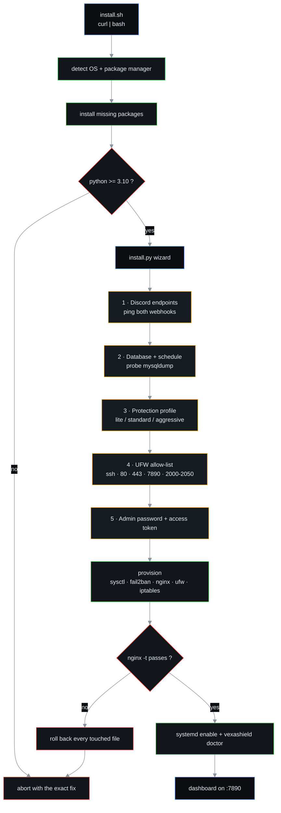
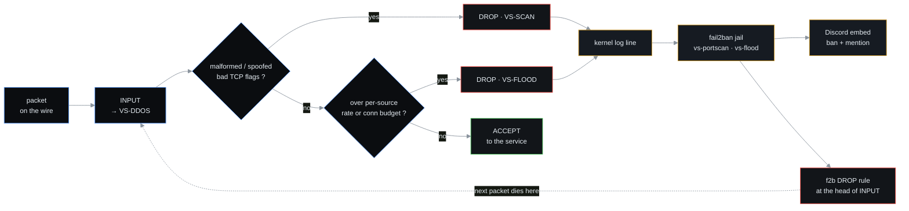
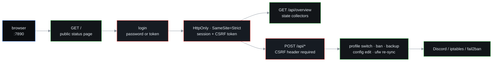

<p align="center">
  <strong>VexaShield</strong><br>
  <sub>Anti-DDoS engine · Discord-delivered database backups · control dashboard</sub>
</p>

<p align="center">
  
  
  
  
  
  
</p>

<p align="center">
  <a href="#-quick-start">Quick start</a> ·
  <a href="#-features">Features</a> ·
  <a href="#-how-it-works">How it works</a> ·
  <a href="#-dashboard">Dashboard</a> ·
  <a href="#-testing">Testing</a> ·
  <a href="#-uninstall">Uninstall</a>
</p>

---

One Python package, stdlib only. Nothing is shelled out to a helper script —
every component (chain builder, backup runner, Discord client, dashboard) is
importable Python.

| | |
| --- | --- |
| **Requires** | Linux · root · Python 3.10+ |
| **Tested on** | Debian 12 · Ubuntu 22.04/24.04 · RHEL/CentOS 8+ · Fedora · openSUSE · Arch · Alpine |
| **Optional** | nginx · fail2ban · ufw · mariadb-client |
| **License** | MIT © [Nex-Devz](https://github.com/Nex-Devz) |

---

## 🚀 Quick start

```bash
curl -fsSL https://raw.githubusercontent.com/Nex-Devz/VexaShield/main/install.sh | bash
```

From a clone instead:

```bash
git clone https://github.com/Nex-Devz/VexaShield.git
cd VexaShield
bash install.sh            # interactive
bash install.sh -y         # every default accepted (CI friendly)
bash install.sh --dry-run  # show the plan, change nothing
```

<details>
<summary>📦 What <code>install.sh</code> does before the wizard starts</summary>

<br>

1. Detects the distribution from `/etc/os-release` (`ID` + `ID_LIKE`).
2. Picks the package manager: `apt-get`, `dnf`, `yum`, `zypper`, `pacman`, `apk`.
3. Maps every logical dependency to **this** distro's package name and installs
   only what is missing.

   | Logical | Debian/Ubuntu | RHEL/Fedora | openSUSE | Arch | Alpine |
   | --- | --- | --- | --- | --- | --- |
   | python | `python3` | `python3` | `python3` | `python` | `python3` |
   | firewall engine | `iptables` | `iptables-nft` | `iptables` | `iptables` | `iptables` |
   | persistence | `iptables-persistent` | `iptables-services` | `iptables` | `iptables` | `iptables` |
   | database client | `mariadb-client` | `mariadb` | `mariadb-client` | `mariadb` | `mariadb-client` |
   | scheduler | `cron` | `cronie` | `cron` | `cron` | `dcron` |
   | ufw | `ufw` | not packaged | `ufw` | `ufw` | `ufw` |
4. Verifies Python ≥ 3.10, fetches the source (when piped through `curl`) and
   runs `install.py`.

Optional packages are best-effort: a distro that does not ship `ufw` never
aborts the install, it degrades to a warning.

</details>

<details>
<summary>🎛 Full installer flag reference</summary>

<br>

| Option | Effect |
| --- | --- |
| `-y`, `--yes` | unattended: accept every default |
| `--no-deps` | skip package installation entirely |
| `--minimal` | python3, curl, ca-certificates, git, gzip, iptables, cron only |
| `--no-nginx` | do not install or provision nginx throttling |
| `--no-fail2ban` | do not install the fail2ban jails |
| `--no-ufw` | do not install or enable the host firewall |
| `--no-dashboard` | install files but leave the dashboard unit off |
| `--dry-run` | print the detected platform and package plan, change nothing |
| `--branch <name>` | fetch a different branch when installing from GitHub |
| `-- <args>` | forward extra flags straight to `install.py` |

`python3 install.py` accepts the same `--no-*` flags and honours `NO_COLOR`,
`VS_ALERT_WEBHOOK`, `VS_BACKUP_WEBHOOK`, `VS_MENTION_ID`, `VS_ADMIN_PASS`,
`VS_ADMIN_EMAIL`, `VS_DB_PASS` and `VS_NONINTERACTIVE=1` for scripted installs. `uninstall.sh` accepts `--keep-data` and `--purge`.

</details>

---

## ✨ Features

| Icon | Component | What it gives you |
| :-: | --- | --- |
| 🔥 | **Anti-DDoS chain** | `VS-DDOS` / `VS-SCAN` / `VS-FLOOD` iptables chains, 3 intensity profiles, IPv6 mirror |
| 🚦 | **HTTP throttle** | nginx `limit_req` + `limit_conn`, `429` on over-limit, auto-ban via fail2ban |
| 🛡 | **fail2ban jails** | http flood, port scan, kernel flood — every ban pushed to Discord |
| 💾 | **Database backups** | `mysqldump` → deflated zip → Discord parts → 7-day retention, verified |
| 📊 | **Dashboard** | stdlib HTTP server on `:7890`, public status page, admin console, password or token login, CSRF |
| 🔒 | **Host firewall** | UFW allow-list staged *before* enable — SSH can never be locked out |
| 🧪 | **Isolated test suite** | 62 checks that never touch the host firewall, fail2ban or nginx |
| 📦 | **Zero dependencies** | no pip installs, no frameworks, no shell helpers |

---

## ⚙️ How it works

### 1 · Install workflow



Every answer is validated before the next step, and every file the installer
touches is snapshotted — a failed validation rolls the whole step back
instead of leaving a half-written nginx config.

### 2 · Packet workflow (runtime)



The chain **scrubs and returns** — it never owns the policy, so a bad rule
cannot lock you out. `vexashield ddos reset` removes only VexaShield's own
chains; UFW, Docker and pre-existing rules stay untouched.

| Layer | Behaviour |
| --- | --- |
| Malformed | fragments, `INVALID` conntrack, spoofed sources (`0/8`, `127/8`, broadcast) |
| Port scans | `NULL`, `XMAS`, `FIN`, `SYN+FIN`, `SYN+RST` → drop + log |
| Connection floods | `hashlimit` per source — 40 / 80 / 150 conn/s by profile |
| Concurrency | `connlimit` per source — 40 / 60 / 40 open connections |
| SSH clamp | max 8 concurrent new connections to port 22 |
| UDP floods | per-source datagram budget, tuned for game panels |
| ICMP | echo budget of 2–5/sec, everything else dropped |
| IPv6 | mirrored chain for flags, rate and ICMPv6 |
| sysctl | syncookies, backlog, `rp_filter`, redirect/source-route off, martian logging |

### 3 · Backup workflow

```mermaid
%%{init: {'theme':'base','themeVariables':{
  'primaryColor':'#121519','primaryTextColor':'#e6edf3','primaryBorderColor':'#5b9cff',
  'lineColor':'#8b949e','fontFamily':'ui-monospace, monospace','fontSize':'13px'}}}%%
flowchart LR
    classDef core fill:#0b0d10,stroke:#5b9cff,color:#e6edf3
    classDef job  fill:#121519,stroke:#3fb950,color:#e6edf3
    classDef net  fill:#161b22,stroke:#d29922,color:#e6edf3
    classDef bad  fill:#121519,stroke:#f85149,color:#e6edf3

    T["systemd timer<br/>daily 02:00 · Persistent"]:::core --> R["vexashield backup run"]:::job
    R --> D["mysqldump"]:::job
    D --> Z["zip · deflate level 6"]:::job
    Z --> U["split ≤ 8 MB parts"]:::job
    U --> P1["Discord part 1..n"]:::net
    P1 --> E["embed: size · duration · parts · rejoin cmd"]:::net
    E --> K["keep 7 days"]:::job
    E -.->|failure| X["failure embed + @mention"]:::bad
```



Success **and** failure both post an embed. `vexashield backup verify`
integrity-checks every archive, and the timer is `Persistent=true`, so a box
that was powered off still catches up.

### 4 · Dashboard workflow



Polling only (5 s / 12 s), no websockets, no framework, `MemoryMax=192M`.
Webhook URLs and the access token are never returned by the API.

---

## 🌐 Dashboard

`http://<host>:7890` — `/` is the public read-only status page (version,
profile, counters, last backup), `/admin` is the console with views for
**Overview**, **Blocked**, **Protection**, **Bans**, **Backups** and
**Settings**, with live actions: switch profile,
re-apply the stack, ban/unban addresses, trigger a backup, edit schedules and
throttle limits, re-sync UFW.

```bash
vexashield dashboard url     # print the URL
```

<details>
<summary>🔐 Dashboard hardening</summary>

<br>

- Admin password (pbkdf2-sha256, 200k rounds) or access-token sign-in,
  constant-time comparison, login rate limiting
- `HttpOnly` + `SameSite=Strict` session cookie, per-session CSRF token
- Strict `Content-Security-Policy`, `X-Frame-Options: DENY`
- Config endpoint returns masked tails only — never a webhook URL or the token
- `/` serves a read-only status page: no session required, no config disclosed
- `MemoryMax=192M` systemd sandbox

</details>

---

## 📖 Commands

<details>
<summary>Full CLI reference</summary>

<br>

```
vexashield status                    health summary
vexashield status --json             full machine-readable state
vexashield ddos apply [--profile P]  rebuild the scrubbing chain
vexashield ddos reset                remove VexaShield chains
vexashield ddos profile aggressive   switch budget profile
vexashield ddos status               counters as JSON
vexashield backup run|list|verify    manual backup operations
vexashield ban add <jail> <ip>       manual ban
vexashield ban del <jail> <ip>       manual unban
vexashield ban list                  show every jail and address
vexashield firewall sync|status      UFW allow-list control
vexashield webhook test [alert|backup|all]
vexashield config show|set KEY VALUE
vexashield dashboard run|url         control panel
vexashield monitor                   attack-rate daemon (Discord alerts)
vexashield doctor                    full diagnosis
```

</details>

<details>
<summary>🗂 Configuration reference — <code>/etc/vexashield/vexashield.conf</code> (mode 0600)</summary>

<br>

| Key | Default | Meaning |
| --- | --- | --- |
| `profile` | `standard` | `lite` / `standard` / `aggressive` |
| `log_drops` | `1` | log dropped packets for fail2ban |
| `allowed_ports` | `22,80,443,7890` | extra TCP allows |
| `allowed_ports_udp` | `7890` | extra UDP allows |
| `allowed_port_ranges` | `2000-2050` | game range, tcp+udp |
| `alert_webhook` / `backup_webhook` | – | Discord endpoints |
| `mention_id` | – | user to ping on events |
| `db_name` / `db_user` | `panel` / `root` | dump target |
| `backup_dir` | `/var/backups/vexashield` | archives (mode `0700`) |
| `backup_at` | `02:00` | daily schedule |
| `backup_retention` | `7` | days kept on disk |
| `backup_chunk_mb` | `8` | Discord part size |
| `nginx_rate` / `nginx_burst` / `nginx_conn` | `10r/s` / `30` / `25` | HTTP throttle |
| `f2b_http_ban` / `f2b_scan_ban` / `f2b_flood_ban` | `600` / `86400` / `1800` | ban windows, seconds |
| `dash_port` / `dash_bind` | `7890` / `0.0.0.0` | dashboard listener |
| `attack_pps_alert` | `500` | monitor alert threshold |

```bash
vexashield config show
vexashield config set profile aggressive
```

</details>

<details>
<summary>📁 Project layout and runtime paths</summary>

<br>

```
VexaShield/
├── install.sh                dependency bootstrap + installer launcher
├── install.py                interactive installer
├── uninstall.sh              bootstrap removal
├── uninstall.py              clean removal
├── vexashield/
│   ├── core.py               paths, config, logging, prompts
│   ├── ddos.py               iptables chain, sysctl, nginx, fail2ban
│   ├── ufw.py                host firewall provisioning
│   ├── backup.py             dump, zip, Discord delivery, retention
│   ├── discord.py            embeds + multipart chunked upload
│   ├── state.py              collectors for the dashboard
│   ├── cli.py                command line
│   └── dashboard/            server, auth, static UI
├── config/
│   ├── fail2ban/             filters, jails, Discord action
│   └── nginx/                throttle templates
├── systemd/                  firewall, dashboard, monitor, backup timer
└── tests/smoke.py            isolated end-to-end suite
```

```
/etc/vexashield/vexashield.conf   config (0600)
/var/lib/vexashield/              state, sessions, rule snapshots
/var/log/vexashield/              per-component logs
/var/backups/vexashield/          archives (0700)
```

</details>

---

## 🧪 Testing

The suite runs inside a temporary directory with `VS_*` environment overrides
— it never touches your host firewall, fail2ban, nginx or systemd.

```bash
python3 tests/smoke.py
python3 tests/smoke.py --keep   # keep the temp dir for inspection
```

| Area | Covered |
| --- | --- |
| CLI | version, config round-trip, file mode `0600`, doctor |
| Installer | `install.sh --help/--dry-run`, flag parsing, no block-art banner |
| Backup | real dump → zip → verify → history → integrity check |
| Anti-DDoS | chain applied inside a network namespace (`unshare -rn`) |
| nginx | template rendering + transactional wiring rollback |
| fail2ban | jail rendering with the Discord action |
| Dashboard | public routes, password and token login, CSRF, 401/403, async backup, config redaction, all assets |
| Config | settings survive without the conf file, admin password stored hashed, ufw rule syntax, prompt fallback |
| Regression | `/etc/nginx` must be byte-identical afterwards |

---

## 🔒 Security notes

- The config holds webhook URLs and DB credentials and is written `0600`.
- The dashboard never returns webhook URLs or the access token — only masked
  tail characters. The public page runs off `/api/public`, which is built by
  hand from a whitelist of fields.
- The admin password is stored only as a pbkdf2-sha256 digest in
  `/var/lib/vexashield/vexashield.db` (`0600`).
- `vexashield ddos reset` removes only VexaShield's own chains; UFW, Docker
  and any pre-existing rules stay untouched.
- On a remote host, keep your SSH session open until `vexashield doctor`
  reports `scrubbing_chain PASS`.

---

## 🗑 Uninstall

```bash
curl -fsSL https://raw.githubusercontent.com/Nex-Devz/VexaShield/main/uninstall.sh | bash
# or
bash uninstall.sh --keep-data     # leave config and backups alone
bash uninstall.sh --purge         # also delete config, logs, state, backups
```

Services, units, the CLI shim, fail2ban jails, the nginx snippet and the
iptables chains are removed. UFW rules and the `sshd` jail are left alone so
your SSH session survives.

---

## 📄 License

MIT © [Nex-Devz](https://github.com/Nex-Devz)
